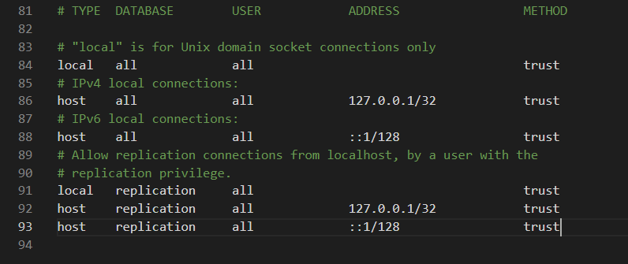

# Summary

The backend part of the Fake News Detection application for the 2021 IP course.

# Setup

## Installing & setting up PostgreSQL

The following instructions assume a Windows operating system is installed.

1. Download the latest version of [PostgreSQL](https://www.enterprisedb.com/downloads/postgres-postgresql-downloads) available for your operating system.

2. Run the installer with the default settings; when prompted for the port, change it to `5433` instead of `5432`.

3. Once finished, go to the installation folder (by default it is `C:\Program Files\PostgreSQL`), then open file `pg_hba.conf` located inside the `data` folder.

4. Scroll all the way down and change `METHOD` column so it looks like this:

5. Go to `Start` -> search for `pgAdmin 4` and open it; you will be prompted to enter a new password. Choose one you will remember in case you need it (the password is irrelevant at this point, since changing the authentication method to `trust` at step 4 means that no password will be required to connect to any PostgreSQL database anyway).

6. Inside `pgAdmin 4`, on the explorer window on left side, right click on `Databases` -> `Create` -> `Database...` and name it `users`.

## Setting up the project in IntelliJ

1. Clone the repository, then open it inside IntelliJ IDEA and run the application.

2. An exception of the sort _"role `rolename` does not exist"_ will pop up in the console; open `pgAdmin 4`, right click on `Login/Group Roles` -> `Create` -> `Login/Group role...` and name it to whatever `rolename` was in the exception text. Then go to the `Privileges` tab, and turn on the first two switches (`Can login?` and `Superuser?`).

3. Inside IntelliJ, run the project again.

Congrats! The server should be up and running at [http://localhost:8081](http://localhost:8081/).

# Issuing HTTP requests

Support for the following HTTP commands has been implemented:

## GET

Can be issued at [http://localhost:8081/api/v1/users](http://localhost:8081/api/v1/users) for a list containing all the users in the database, or at [http://localhost:8081/api/v1/users/id](http://localhost:8081/api/v1/users/id) for a user identified by `id` (currently, this is a natural number starting from 1, which is generated automatically when registering the user in the database).

## POST

Can be issued at [http://localhost:8081/api/v1/users](http://localhost:8081/api/v1/users) to register a new user into the database. The request body should only contain the attributes `username` and `password`.

## PUT

Can be issued at [http://localhost:8081/api/v1/users/id](http://localhost:8081/api/v1/users/id) to update a user identified by `id`, together with a request body identitcal to the `POST` method.

## DELETE

Can be issued at [http://localhost:8081/api/v1/users/id](http://localhost:8081/api/v1/users/id) to delete a user identified by `id`.

# Unit tests

Unit tests have been written for the controller responsible for the user system, as well as for the user service that the controller manages. They are located inside `demo/src/test`.

